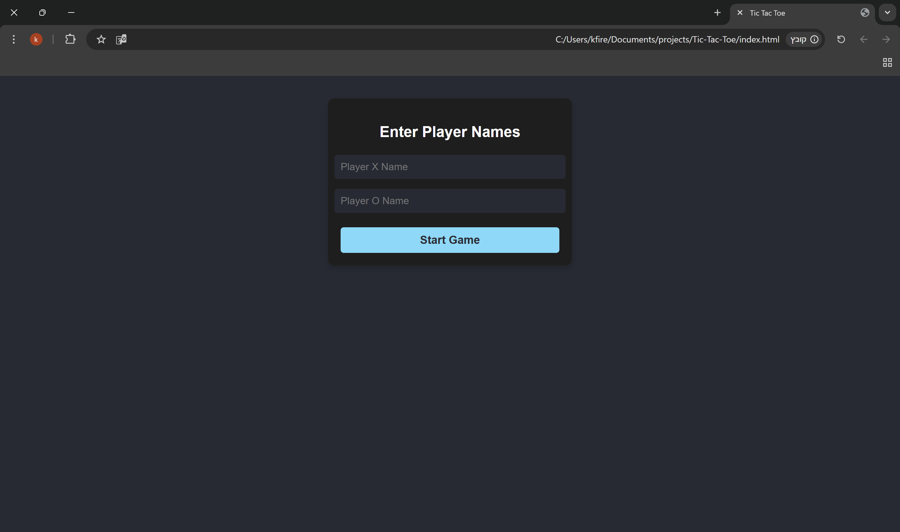
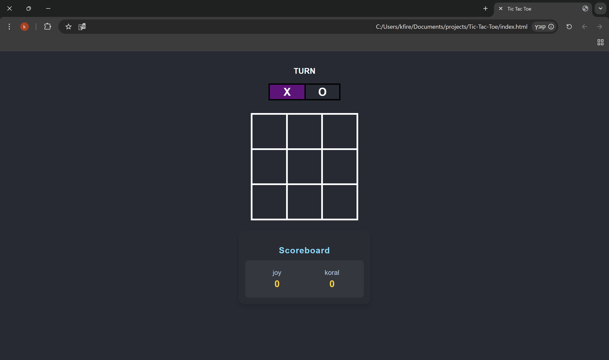

# Tic-Tac-Toe

A simple Tic-Tac-Toe game built using **HTML**, **CSS**, and **JavaScript**. Players take turns marking `X` and `O` in a 3×3 grid, and the first player to align three symbols **vertically**, **horizontally**, or **diagonally** wins!

